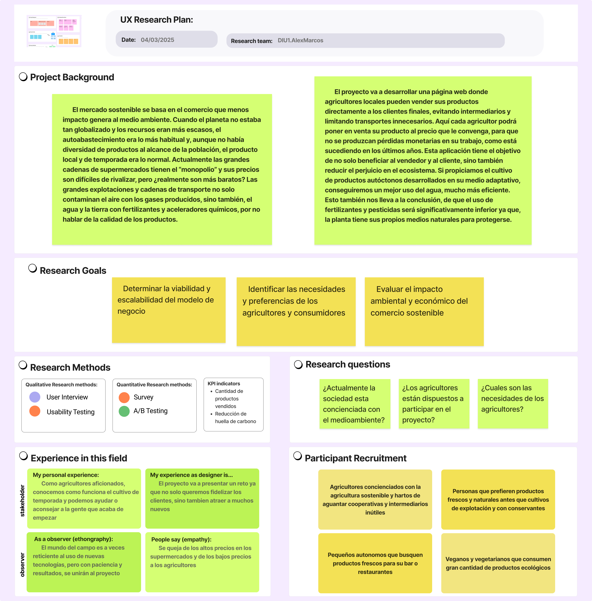

## DIU - Practica1, entregables

- Desk research: Análisis Competencia

  ## [User research plan](https://github.com/AlexMr08/UX_CaseStudy/blob/master/P1/researchPlan.pdf)
    

  Tras investigar internet en busca de comptencia hemos encontrado las siguientes paginas webs:
  - [Ecocentro](https://www.ecocentro.es/tienda/): Es una web de un mercado ecologico afincado en Madrid, es seguramente el mas parecido a Valle&Vega, su principal problema es que actualmente limita la entrega de productos frescos a Madrid. Tiene envio gratuito a partir de 60€. Ademas incluye una seccion para buscar restaurantes bio-vegetarianos.
  - [Naturitas](https://www.naturitas.es/): Es una de las webs con mas productos que hemos encontrado, aunque se aleja un poco del modelo de mercado sostenible, aunque sigue vendiendo productos ecologicos. Tiene un programa de puntos que te permite obtener descuentos. El envio es gratuito a partir de 49€.
  - [Biobay](https://biobay.es/): Al igual que la anterior no vende productos frescos aunque añade productos veganos que las otras alternativas no suelen ofrecer. Tiene envio gratuito a partir de 79€.
  - [Biosano](https://biobay.es/): Es similar a las 2 anteriores, pero seguramente es la que tiene menos productos de alimentacion. Tiene envio gratuito a partir de 49€.
  
  Ademas de las 2 dadas:
  - [EcoMercado de Granada](https://ecomercadogranada.org/): Esta es la que menos nos ha gustado, ya que solo mantienen actualizadas sus redes sociales, ademas no realizan venta online, por lo que si bien a nivel local puede ser una opcion muy atractiva, el hecho de no tener una web actualizada ni la opcion de vender productos online le quita muchos puntos.
  - [Valle&Vega](https://valleyvega.org/): Es una de las mejores opciones disponibles en Granada ya que permite la recogida del producto en diversos comercios locales, asi como envio a domicilio, para que el pedido sea gratuito debe tener un coste mayor a 60€, aunque esto solo se aplica a Granada. Junto a la anterior, es la mejor opcion para apoyar a los agricultores locales.

    |EMPRESAS                             | EcoMercado      | Valle&Vega | Ecocentro     | Naturitas   | Biobay      | Biosano  |
    | :------:                            | :------:        | :------:   |  :------:     | :------:    |  :------:   | :------: |
    | Buscador (0.5)                      | SI              |  SI        |     SI        | SI          | SI          | SI       |
    | Contacto (0.5)                      | SI              |  SI        |     SI        | SI          | SI          | SI       |
    | Venta online (2.5)                  | NO              |  SI        |     SI        | SI          | SI          | SI       |
    | Accesibilidad (0.5)                 | SI              |  NO        |     NO        | NO          | NO          | NO       |
    | Responsive (1)                      | SI              |  SI        |     SI        | SI          | SI          | SI       |
    | Realiza envios (1.5)                | NO              |  SI        |     SI        | SI          | SI          | SI       |
    | Registro (0.5)                      | NO              |  SI        |     NO        | SI          | NO          | SI       |
    | Venta de productos frescos (2)      | SI              |  SI        |     SI        | NO          | NO          | NO       |
    | Recogida local (Granada) (1)        | SI              |  SI        |     NO        | NO          | NO          | NO       |
    | Nota sobre 10                       | 6               |  9         |     8.5       |  6          | 6           | 6        |

  ## [Analisis de la competencia](https://github.com/AlexMr08/UX_CaseStudy/blob/master/P1/competitorAnalysis.pdf)
    
    
- 2 Personas

  Hemos creado 2 personas, una por cada miembro del equipo. Estas son Armando y Gara. El primero es un militar jubilado que reside en Cortes de Baza. La segunda una diseñadora grafica que reside en la periferia de Granada. Hemos pasado por varias etapas a la hora de crear a las personas, originalmente solo una era de Granada, pero dado que las principales alternativas solo se encuentran en Granada y que Armando ya vivia fuera del nucleo urbano de Granada, decidimos hacer que Gara si que habite en este. Esto nos permite ver como nuestras personas interactuan con las distintas paginas que permiten recogida en comercios locales y envios a domicilio.
  
  ## [Armando Guerra](https://github.com/AlexMr08/UX_CaseStudy/blob/master/P1/persona1.pdf)
  
  
  ## [Gara Suarez](https://github.com/AlexMr08/UX_CaseStudy/blob/master/P1/persona2.pdf)
  
  
- 2 User Journey Map  ( 1 por persona)

  Hemos creado 2 journey map. El primero cuenta como Armando descubre la web gracias a Facebook y tras comprobar que sea realmente ecologica, decide realizar un pedido, en el cual compra el doble de un producto por culpa de la poca retroalimentacion de este, aun asi el envio se realiza de forma rapido . El segundo cuenta la primera experiencia de Gara con Valle&Vega, tras decidir probar la web, encuentra una serie de cosas que no le gustan demasiado en el proceso de compra, aunque esto no hace que deje de usar la web ya que las alternativas no tienen todo lo que busca.

  ## [Journey Map de Armando](https://github.com/AlexMr08/UX_CaseStudy/blob/master/P1/journeyMap1.pdf)
  

  ## [Journey Map de Gara](https://github.com/AlexMr08/UX_CaseStudy/blob/master/P1/journeyMap2.pdf)
  
  
- Revisión de Usabilidad y briefing
  
  ## [Revision de usabilidad](usabilityReserach.pdf)

  ## Briefing

  Hemos realizado la revision de usabilidad a Valle&Vega, ya que creemos que es nuestra competencia mas fuerte y la mejor opcion en el mercado local, actualmente.
En general, la web tiene muchisimas cosas buenas y algunas que deben mejorar, pero no hemos encontrado cosas que destaquen de forma muy negativa. Las cosas a mejorar son sobre todo referentes a su herramienta de busqueda que no permite ciertas acciones relativamente basicas como el filtrado de productos. El feedback no siempre es bueno, como hemos mencionado, ciertos botones caracen de interaccion al ser pulsados, ocasionando ciertas dudas sobre si hemos pulsado correctamente o no. Tambien hemos notado que en los formularios no se nos indica un ejemplo que facilite rellenarlo o que si enviamos el formulario con un dato erroneo, este suele borrar otros campos validos. Su rendimiento es bastante bueno, aunque a veces tarda un poco en cargar. Hasta ahora solo nos hemos centrado en cosas negativas, pero no hemos hablado de cosas positivas, esta web destaca en que su uso es bastante sencillo y que esta todo bien organizado. La pagina de inicio pese a tener demasiados espacios en blanco tiene informacion interesante y es bastante facil de usar para nuevos usuarios.
