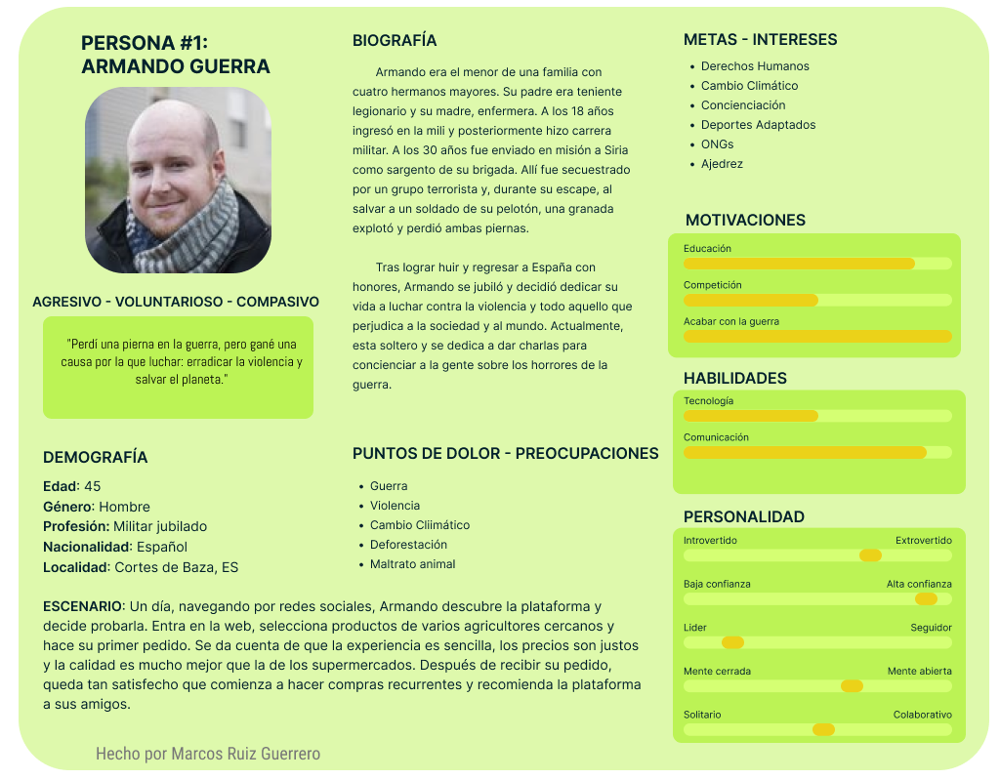
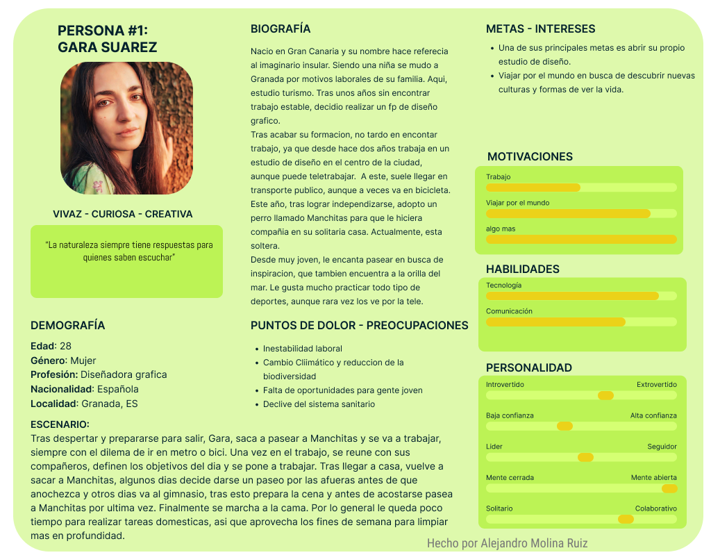

## DIU - Practica1, entregables

- Desk research: Análisis Competencia
  Tras investigar internet en busca de comptencia hemos encontrado las siguientes paginas webs:
  - [Ecocentro](https://www.ecocentro.es/tienda/): Es una web de un mercado ecologico afincado en Madrid, es seguramente el mas parecido a Valle&Vega, su principal problema es que actualmente limita la entrega de productos frescos a Madrid. Tiene envio gratuito a partir de 60€. Ademas incluye una seccion para buscar restaurantes bio-vegetarianos.
  - [Naturitas](https://www.naturitas.es/): Es una de las webs con mas productos que hemos encontrado, aunque se aleja un poco del modelo de mercado sostenible, aunque sigue vendiendo productos ecologicos. Tiene un programa de puntos que te permite obtener descuentos. El envio es gratuito a partir de 49€.
  - [Biobay](https://biobay.es/): Al igual que la anterior no vende productos frescos aunque añade productos veganos que las otras alternativas no suelen ofrecer. Tiene envio gratuito a partir de 79€.
  - [Biosano](https://biobay.es/): Es similar a las 2 anteriores, pero seguramente es la que tiene menos productos de alimentacion. Tiene envio gratuito a partir de 49€.
  Ademas de las 2 dadas:
  - [EcoMercado de Granada](https://ecomercadogranada.org/): Esta es la que menos nos ha gustado, ya que solo mantienen actualizadas sus redes sociales, ademas no realizan venta online, por lo que si bien a nivel local puede ser una opcion muy atractiva, el hecho de no tener una web actualizada ni la opcion de vender productos online le quita muchos puntos.
  - [Valle&Vega](https://valleyvega.org/): Es una de las mejores opciones disponibles en Granada ya que permite la recogida del producto en diversos comercios locales, asi como envio a domicilio, para que el pedido sea gratuito debe tener un coste mayor a 60€, aunque esto solo se aplica a Granada. Junto a la anterior, es la mejor opcion para apoyar a los agricultores locales.

|EMPRESAS                             | EcoMercado      | Valle&Vega | Ecocentro     | Naturitas   | Biobay      | Biosano  |
| :------:                            | :------:        | :------:   |  :------:     | :------:    |  :------:   | :------: |
| Buscador (0.5)                      | SI              |  SI        |     SI        | SI          | SI          | SI       |
| Contacto (0.5)                      | SI              |  SI        |     SI        | SI          | SI          | SI       |
| Venta online (2.5)                  | NO              |  SI        |     SI        | SI          | SI          | SI       |
| Accesibilidad (0.5)                 | SI              |  NO        |     NO        | NO          | NO          | NO       |
| Responsive (1)                      | SI              |  SI        |     SI        | SI          | SI          | SI       |
| Realiza envios (1.5)                | NO              |  SI        |     SI        | SI          | SI          | SI       |
| Registro (0.5)                      | NO              |  SI        |     NO        | SI          | NO          | SI       |
| Venta de productos frescos (2)      | SI              |  SI        |     SI        | NO          | NO          | NO       |
| Recogida local (Granada) (1)        | SI              |  SI        |     NO        | NO          | NO          | NO       |
| Nota sobre 10                       | 6               |  9         |     8.5       |  6          | 6           | 6        | 

- 2 Personas

  Hemos creado 2 personas, una por cada miembro del equipo. Estas son Armando y Gara. El primero es un militar jubilado que reside en Cortes de Baza. La segunda una diseñadora grafica que reside en la periferia de Granada.
  
  ## [Armando Guerra](https://github.com/AlexMr08/UX_CaseStudy/blob/master/P1/persona1.pdf)
  
  
  ## [Gara Suarez](https://github.com/AlexMr08/UX_CaseStudy/blob/master/P1/persona2.pdf)
  
  
- 2 User Journey Map  ( 1 por persona)

  Hemos creado 2 journey map. El primero se basa en \<no esta aun\>. El segundo cuenta la primera experiencia de Gara con Valle&Vega, tras decidir probar la web, encuentra una serie de cosas que no le gustan demasiado en el proceso de compra, aunque esto no hace que deje de usar la web ya que las alternativas no tienen todo lo que busca.

  ## [Journey Map de Armando](https://github.com/AlexMr08/UX_CaseStudy/blob/master/P1/journeyMap1.pdf)
  

  ## [Journey Map de Gara](https://github.com/AlexMr08/UX_CaseStudy/blob/master/P1/journeyMap2.pdf)
  
  
- Revisión de Usabilidad 

>>>> Este fichero se debe editar para que cada evidencia quede enlazada con el recurso subido a la carpeta de la practica. Se pide más detalle técnico en las descripciones de lo que sería el README principal del repositorio y que corresponde a la descripcion del Case Study.
>>>> Incluya aquí simpre una valoración final del equipo sobre la propia realización de la práctica

- 
