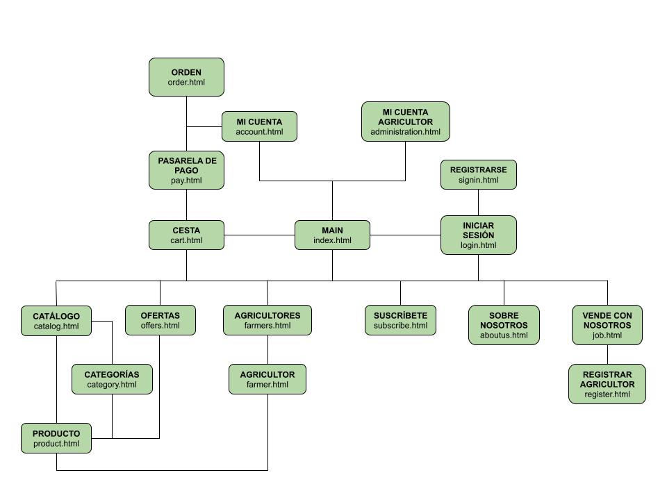
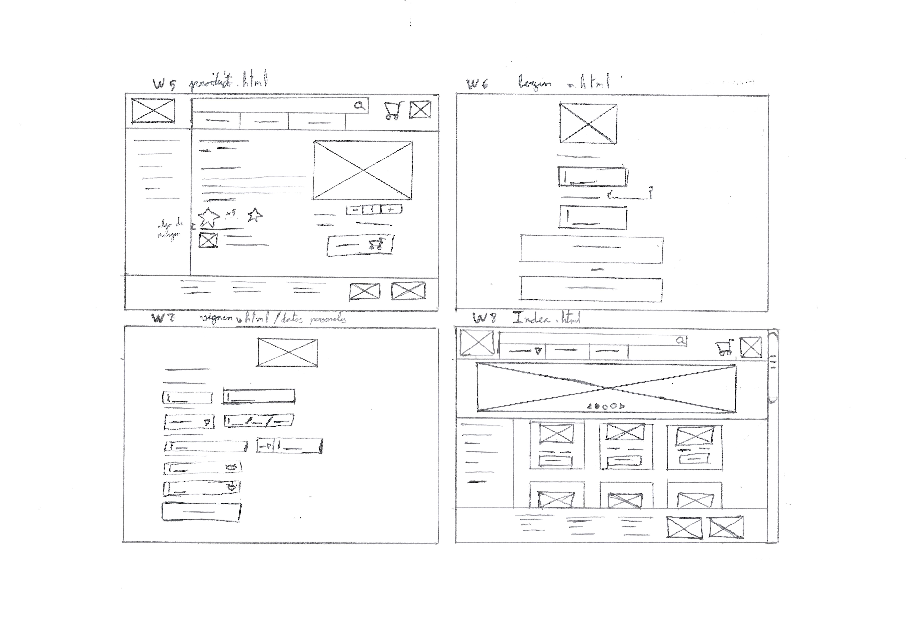

## DIU - Practica2, entregables

### Ideación 
* Malla receptora de información

  Hemos creado una malla receptora de informacion en base a los puntos fuertes y debiles de la competencia, las preguntas que tienen nuestras personas y las ideas que hemos tenido nosotros para el negocio. 
  
* Mapa de empatía

  Tras la malla receptora de informacion, hemos hecho un mapa de empatia, usando a nuestras personas, para ver lo que piensan, sienten, ven, escuchan, dicen y hacen dos personas, así como sus frustraciones y deseos.
  

### PROPUESTA DE VALOR
* ScopeCanvas
  
  

### TASK ANALYSIS

* User Task Matrix

  Tras realizar la propuesta de valor hemos definido algunas de las acciones que se podran realizar en la plataforma, ya que podrian ir surgiendo mas para satisfacer una necesidad de los usuarios que en un primer momento no se tuvo en cuenta.
  | Acción | Agricultor | Cliente | Visitante | Suscriptor | Media (%) |
  | --- | --- | --- | --- | --- | --- |
  | Comprar carrito | 0.60 | 0.850 | 0.20 | 0.90 | 0.63750 |
  | Buscar productos por categoría o cercanía | 0.10 | 0.800 | 0.80 | 0.60 | 0.57500 |
  | Seleccionar método de entrega o recogida | 0.00 | 1.000 | 0.30 | 1.00 | 0.57500 |
  | Añadir direccion de entrega | 0.30 | 0.870 | 0.00 | 0.95 | 0.53000 |
  | Crear perfil con información personal | 1.00 | 1.000 | 0.00 | 0.10 | 0.52500 |
  | Valorar productos y dejar reseña | 0.60 | 0.700 | 0.00 | 0.80 | 0.52500 |
  | Añadir producto al carrito | 0.40 | 0.700 | 0.20 | 0.75 | 0.51250 |
  | Añadir datos de pago | 0.60 | 0.600 | 0.00 | 0.80 | 0.50000 |
  | Pagar a través de la plataforma | 0.00 | 1.000 | 0.00 | 1.00 | 0.50000 |
  | Visualizar y gestionar pedidos recibidos | 1.00 | 0.200 | 0.00 | 0.80 | 0.50000 |
  | Añadir reseñas de productos comprados | 0.50 | 0.600 | 0.00 | 0.70 | 0.45000 |
  | Comprar productos directamente | 0.00 | 0.800 | 0.20 | 0.75 | 0.43750 |
  | Recibir notificaciones sobre pedidos | 1.00 | 0.300 | 0.00 | 0.40 | 0.42500 |
  | Ver perfil del agricultor y su historia | 0.05 | 0.700 | 0.50 | 0.30 | 0.38750 |
  | Acceder a estadísticas de ventas | 1.00 | 0.400 | 0.00 | 0.10 | 0.37500 |
  | Borrar elementos del carrito | 0.35 | 0.500 | 0.00 | 0.35 | 0.30000 |
  | Cerrar sesion | 0.30 | 0.450 | 0.00 | 0.35 | 0.27500 |
  | Establecer precios y stock | 1.00 | 0.000 | 0.00 | 0.00 | 0.25000 |
  | Publicar productos a la venta | 1.00 | 0.000 | 0.00 | 0.00 | 0.25000 |
  | Iniciar sesion | 0.00 | 0.000 | 0.85 | 0.00 | 0.21250 |
  | Añadir ubicacion (Agricultor) | 0.80 | 0.000 | 0.00 | 0.00 | 0.20000 |
  | Crear perfil de agricultor | 0.00 | 0.400 | 0.00 | 0.30 | 0.17500 |
  | Registrarse en la plataforma | 0.00 | 0.000 | 0.70 | 0.00 | 0.17500 |
  | Cancelar pedido | 0.10 | 0.300 | 0.00 | 0.27 | 0.16750 |
  | Contactar con el soporte técnico | 0.30 | 0.200 | 0.05 | 0.10 | 0.16250 |
  | Solicitar recogida en ubicacion del agricultor | 0.20 | 0.003 | 0.00 | 0.30 | 0.12575 |
  | Dar de baja cuenta | 0.15 | 0.100 | 0.00 | 0.05 | 0.07500 |
  | Modificar datos envio | 0.10 | 0.100 | 0.00 | 0.05 | 0.06250 |
  | Cancelar suscripcion | 0.00 | 0.000 | 0.00 | 0.05 | 0.01250 |

* User/Task flow

  Hemos definido una de las actividades mas importantes de la plataforma, la compra de productos. Para simplificar un poco el proceso, hemos supuesto que el usuario tiene la sesion iniciada y que tiene elementos en el carrito, en esta vemos como se pulsa sobre el icono del carrito (que se encontrara visible en la mayoria de las paginas) y empezara el proceso de pago, empezando por mostrar el carrito y acabando con el resumen del pedido donde este se podra cancelar y modificar. No se ha mostrado, pero en el momento que el pedido pase a entregado, se mostrara en esta pagina la opcion de valorar los productos.
  

### ARQUITECTURA DE INFORMACIÓN

* Sitemap
  
  Hemos creado un mapa del sitio, que podria cambiar en un futuro si se incluyen acciones que inicialmente no se habian contemplado y que requieran secciones nuevas.  
  
  
* Labelling
  
  | Nombre | Descripción |
  | --- | --- |
  | Main (index.html) | Página de inicio de la web |
  | Iniciar sesión (login.html) | Página de inicio de sesión, que nos permite además acceder al registro. |
  | Registrarse (signin.html) | Página donde podremos registrarnos en la web. |
  | Mi cuenta (account.html) | Página que contendrá nuestros datos personales y donde podremos modificarlos. Además tendrá el historial de pedidos que hemos realizado. |
  | Mi cuenta agricultor (administration.html) | Al igual que la anterior, mostrará y permitirá modificar la información del agricultor, será donde podrá añadir productos agrícolas y donde verá los pedidos que le han realizado. |
  | Cesta (cart.html) | Mostrará los elementos que el usuario tiene en la cesta y contendrá un botón para empezar el proceso de compra. |
  | Pasarela de pago (pay.html) | Sitio donde rellenaremos los datos necesarios para el pedido y donde se realiza el pago. |
  | Orden (order.html) | Nos muestra el resumen del pedido y podremos cancelarlo o modificar los datos de entrega. Cuando se haya entregado, se podrá valorar el producto. |
  | Suscribete (subscribe.html) | Nos mostrará información sobre la suscripción y permitirá iniciar el proceso para obtener sus ventajas. |
  | Sobre nosotros (aboutus.html) | Muestra información sobre nosotros, la empresa agrored. |
  | Vende con nosotros (job.html) | Te muestra cómo puedes trabajar con nosotros y sus ventajas, además te permite acceder al registro de agricultores. |
  | Registrar agricultor (register.html) | Permite el registro del agricultor en la plataforma. |
  | Agricultores (farmers.html) | Nos mostrará un listado de todos los agricultores, que además contendrá un mapa con la ubicación de los que hayan añadido su ubicación exacta. |
  | Agricultor (farmer.html) | Nos mostrará la información del agricultor y todos los productos que vende, además habrá un mapa con su ubicación en caso de disponer de esta. |
  | Catálogo (catalog.html) | Muestra todos los productos agrarios disponibles en la plataforma. Este se muestra al pulsar sobre catalogo (mostrará todo), al realizar una búsqueda por nombre de producto o por ubicación (mostrará solo las coincidencias) o al pulsar sobre una categoría (mostrará solo dicha categoría), además permitirá acceder a la información\n de cada producto o añadirlo a la cesta directamente. |
  | Ofertas (offers.html) | Muestra el listado de ofertas disponibles en ese momento. |
  | Categorías (category.html) | Muestra todas las categorías de productos que hay en la plataforma. |
  | Producto (product.html) | Muestra la información de un producto y permitirá añadirlo a la cesta. |

  
### Prototipo Lo-FI Wireframe 

  Por ultimo hemos creado 8 wireframes, los 4 primeros son los mismos usados para el user/task flow y los 4 ultimos son de las acciones mas importantes de una web, esten o no en las primeras posiciones de la tabla de acciones. Estas seran la pagina de inicio de sesion, la de registro, la pagina principal y la pagina que nos muestra la informacion de un objeto.
  
  

### Conclusiones  
Hemos definido varios aspectos importantes de nuestra plataforma, como son las acciones que se han de llevar a cabo y la propuesta de valor, que nos hara destacar sobre otras alternativas, entre otras cosas. Creemos que si bien hay ciertos wireframes (el de inicio de sesion y registro) que podrian ser mejores, en general estan bien. Ademas hemos descubierto ciertas cosas que piensan nuestras personas que en la primera practica no habiamos pensado.
