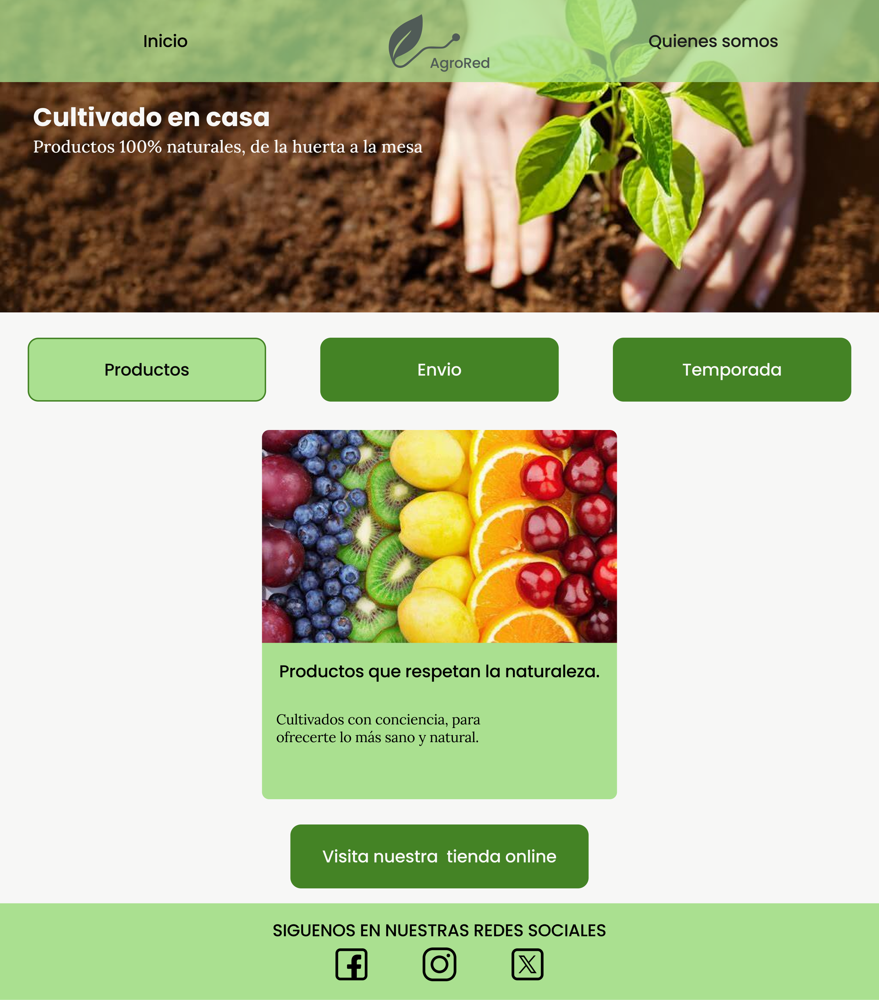
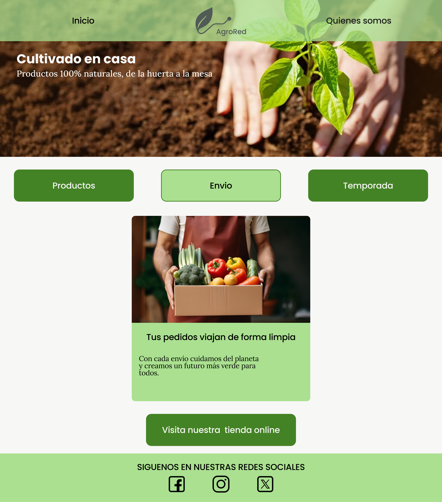
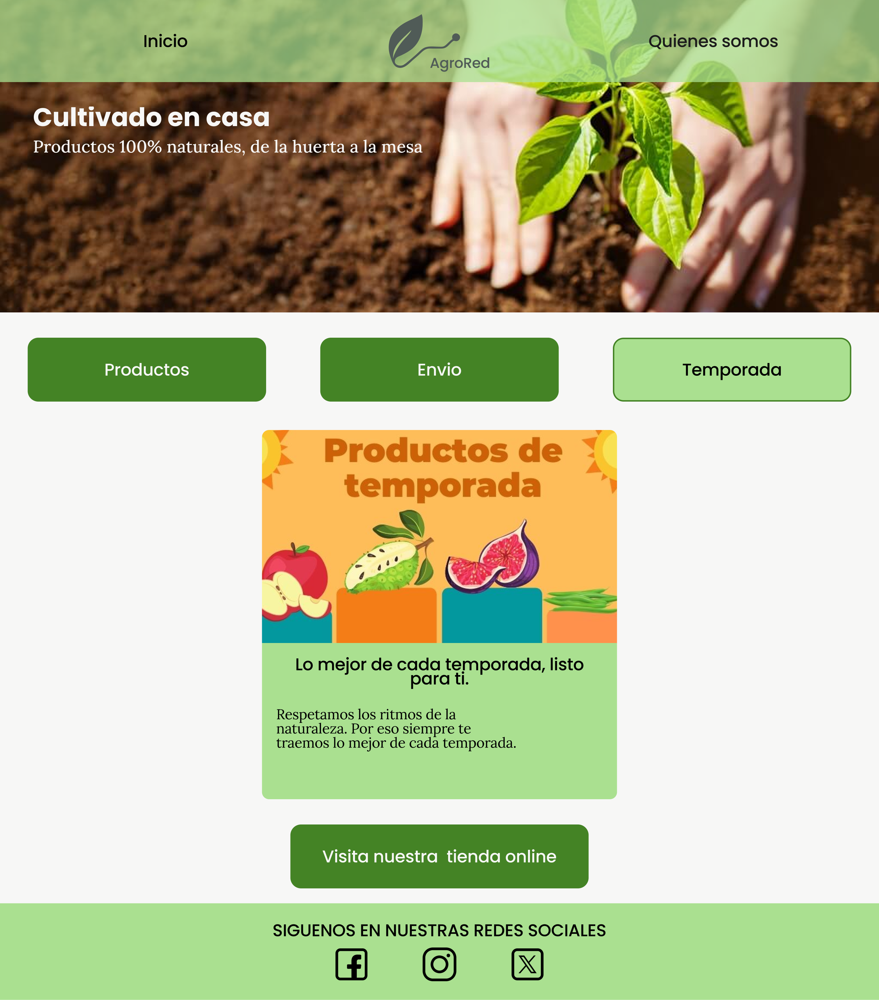

# DIU - Practica 3, entregables

- Moodboard (diseño visual + logotipo)
  Hemos creado un logo que buscamos que represente la conexion de la naturaleza con la tecnologia, mediante una hoja verde que tiene en su tallo la forma de una linea de red, nuestro lema es claro y conciso, ¿que hay mejor que cultivar en casa? Exacto, comprar en AgroRed. Hemos creado varias versiones de nuestro logo en distintas colores para que se pueda usar en secciones distintas de la web o incluso en paqueteria, asi como elegido una paleta de colores enfocandonos sobre todo en tonalidades de verde y gris, el primero porque creemos que encaja muy bien con el proyecto y el segundo para no depender exclusivamente de tonos muy cercanos al blanco o al negro que no encajen bien con los tonos de verde, ademas hemos seleccionado un tono de amarillo para indicar al usuario ciertos avisos y el negro para cuando el contraste del verde con los grises en textos no sea optimo. Tambien hemos elegido 2 fuentes, la primera, poppins la usaremos sobre todo para textos cortos, como titulos, botones o nombres de producto entre otras cosas y la segunda fuente sera Lora, esta fuente tiene serifa y se usara para textos mas largos, por ejemplo, descripciones de productos. 
- Landing Page
  Hemos creado nuestra landing page, dado que no queriamos ceñirnos al clasico modelo en F de las paginas web, la cabecera tiene nuestro logo en el centro, con solo 2 enlaces a su lado para no dar la sensacion de saturacion en esta, ademas, hemos decidido mostrar una unica propuesta de valor en cada momento, por lo que tendremos 3 botones para cambiar entre ellas. Por ultimo tenemos un boton para acceder a la tienda online, el diseño basico esta practicamente completado, pero podria variar aun cosas como las imagenes o la posicion de algun elemento, como que el boton de ir a la tienda online pase a donde hemos colocado el quienes somos, para focalizar la atencion en este.
  
  
  
- Mockup: LAYOUT HI-FI
- Publicación del Case Study

## Conclusiones

>>>> Este fichero se debe editar para que cada evidencia quede enlazada con el recurso subido a la carpeta de la practica. Se pide más detalle técnico en las descripciones de lo que sería el README principal del repositorio y que corresponde a la descripcion del Case Study.
>>>> Termine con la seccion de Conclusiones para aportar una valoración final del equipo sobre la propia realización de la práctica
