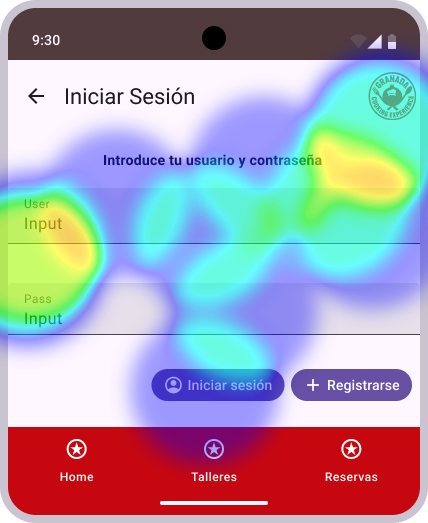

# Usability Report

#### Evaluación de usabilidad del proyecto 

###  Granada Cooking

### 30/05/2025

[Granada Cooking](https://github.com/cgardia1409/UX_CaseStudy)

### Realizado por:

Alejandro Molina Ruiz

Marcos Ruiz Guerrero 

## 1 DESCRIPCIÓN DEL WEBSITE

La aplicacion se usa para realizar reservas de talleres culinarios, en esta podremos ver los distintos talleres disponibles, reservar el que nos interese y ver los talleres a los que nos hemos inscrito previamente.

## 2 RESUMEN EJECUTIVO

Tenemos un prototipo al que le realizaremos una serie de pruebas, estas iran desde una serie de test en Maze y un eyetracker a un informe SUS, ademas de un usability review. Tras echar un primer vistazo al prototipo vemos como el diseño podria ser mejorable, reduciendo el uso de colores en las distintas areas para aumentar la cohesion de los temas del prototipo. Ademas hay ciertas acciones que estan relativamente ocultas y deberian estar mas accesibles, por ejemplo, el inicio de sesion. Este estudio se realiza para indicar al equipo DIU2.LosColegas que deben de mejorar en su producto.

## 3 METODOLOGIA 

#### Metodología de usabililidad

Hemos buscado evaluar como de complejo es el uso del sistema a la hora de realizar la principal funcion del sistema, realizar reservas. Para ello hemos creado una serie de pruebas en Maze en las que se instaba al usuario a probar libremente el sistema y evaluar el diseño, tras lo cual se le pedia realizar una reserva e indicar si le parecio dificil, para acabar deberia indicar si recomendaria el sistema y rellenar un formulario SUS. Ademas hemos seleccionado un unico usuario (Pepe) que realizara una prueba de eye tracking para ver en que se fija principalmente.

#### Test de usuarios: Participantes

Hemos seleccionado 4 participantes, empezando por nosotros que hemos realizado el test de forma imparcial, seguidos de gente del exterior como son Pepe, un mecanico de 60 años con una experiencia media en TICs, Natalia de 25 años con una alta experiencia y Ana de 27 años y una experiencia media en TICs. De esta forma, le mostramos a gente de edades y experiencia en TICs diversas el prototipo y vemos como se desenvuelven en el.

#### Resultados obtenidos

- Resultado de SUS

  Mostramos tanto uno de los formularios SUS realizados como una tabla con los resultados obtenidos del resto.

  | Usuarios | Valoracion SUS | Caso
  | ------------- | ---------- | ----
  | Nosotros      | 82.5        | B 
  | Pepe          | 72.5        | B 
  | Natalia       | 60      | B 
  | Ana           | 75      | B

  La valoracion media es de 72.5 es decir una calificacion Buena.

- resultado de eyetracking

    Estos son los resultados del eye tracker realizado a Pepe
  
    
    
    
    
    
    

- resultados del test en MAZE

  [Resultados Maze](.pdf)
  Como se puede ver la valoracion del diseño del producto esta repartida entre 2 y 5, dando una media de 3.5 sobre 5. Todo el mundo consiguio hacer la reserva y a nadie le parecio dificil. Por ultimo, vemos que tenemos 2 detractores y solo un promotor, en la ultima pregunta del test. Gracias a esto, podemos ver que el nps es de -25 indicando un valor muy bajo, ya que por debajo del 0 es un mal valor.

## 4 CONCLUSIONES 

Podemos deducir que si bien el diseño a resultado atractivo a la gente y que ciertas funciones del sistema no son muy complejas, los usuarios no recomendarian el producto, esto puede deberse a que no esten suficientemente interesados en el producto o que la falta de mas funciones hagan que no tengan las suficientes opciones. Por nuestra parte, el unificar colores nos parece una prioridad, ya que hay cierta desconexion entre algunas zonas del proyecto. Ademas, añadiriamos un destino mas en el navegador inferior para poder acceder a la cuenta del usuario, en vez de dejarla en el menu desplegable.

#### Incidencias

Nada, el producto funciona correctament.

#### Valoración 

- La idea es muy buena.
- El producto es bastante facil de usar.

#### Recomendaciones y propuesta de mejoras: 

- Se podria mejorar el uso de los colores.
- La navegacion podria simplificarse, ya que el inicio de sesion y la cuenta estan muy escondidos.

#### Valoración de la prueba de usabilidad (self-assesment)

En base a los resultados del SUS y la pregunta sobre diseño de Maze, le pondriamos un 7,5-8, es decir esta Bien y con pequeños cambios podria llegar a ser un producto muy notable.
