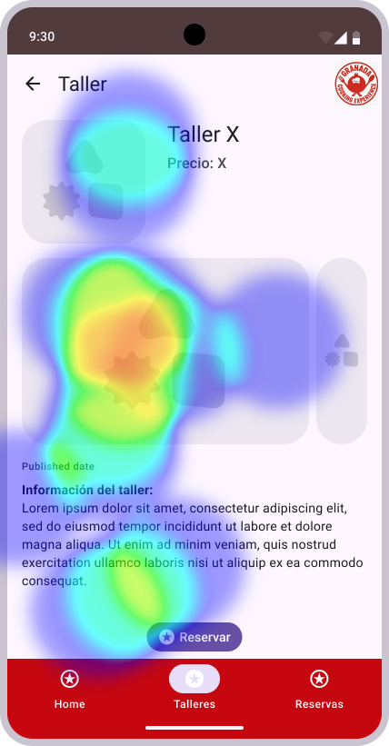
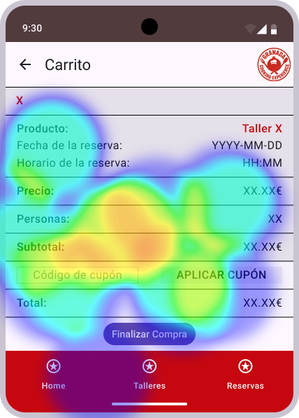
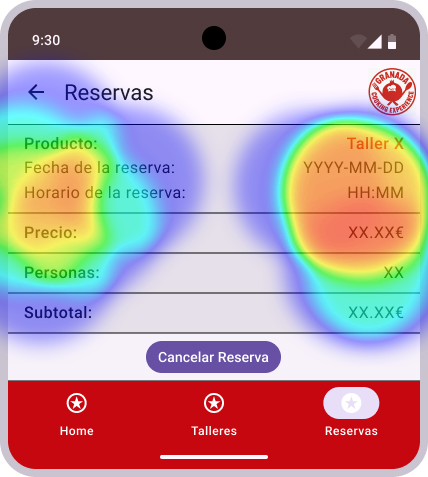

# DIU - Practica 4, entregables

- Users. Elección y características de los usuarios reclutados

  Tenemos un grupo de 8 usuarios (nosotros incluidos como grupo), que habran probado el prototipo A o B. 

  | Usuarios | Sexo/Edad     | Ocupación   |  Exp.TIC    | Personalidad | Plataforma | Caso
  | ------------- | -------- | ----------- | ----------- | -----------  | ---------- | ----
  | Alvaro        | H / 20   | Estudiante  | Media       | Introvertido | Web.       | A 
  | Maria         | M / 52   | Delineante  | Media       | Tranquila    | Web        | A 
  | Pablo         | H / 24   | Estudiante  | Baja        | Curioso      | Web        | A 
  | Jose Maria    | H / 20   | Estudiante  | Alta        | Tranquilo    | Web        | A
  | Nosotros      | H / 24   | Estudiantes | Alta        | Curioso      | Web        | B 
  | Pepe          | H / 60   | Mecanico    | Media       | Curioso      | Web        | B 
  | Natalia       | M / 25   | T.Social    | Alta        | Emocional    | Móvil      | B 
  | Ana           | M / 27   | Farmacéutica| Media       | Racional     | Móvil      | B

- Diseño de las pruebas

  Tenemos 2 formularios en MAZE, el primero sera para el caso A y el segundo para el caso B, en ambos casos se pedira que prueben libremente el producto, posteriormente deberan evaluar su diseño, tras esto, se debera realizar un pedido o una reserva, segun nos toque A o B, finalmente deberemos indicar que probabilidad hay de que recomendemos dicho producto a un amigo. Para terminar, una vez finalizado el test deberan rellenar una encuesta SUS.

- Eyetracker y Maze

  Como ya hemos mencionado, hemos usado tanto un eye-tracker como Maze para la realizacion de pruebas, pero nos centraremos en MAZE.
  Tras realizar la prueba con los 8 usuarios mencionados anteriormente este fue el resultado de ambos test.

  [Resultados A](report_agrored.pdf)
  
  [Resultados B](report_granadaCooking.pdf)

  Podemos observar que todos los usuarios han completado la prueba de la reserva y que a ninguno le ha parecido dificil. Aunque si que vemos como a nivel de diseño, la opcion A tiene una calificacion bastante superior a la opcion B. Por ultimo, antes de calcular el NPM, vemos como en la opcion A no tenemos detractores, aunque si que tenemos usuarios neutrales, pero como en la B si que podemos observar que se reparte la muestra entre detractores, promotores y usuarios neutrales.

- NPS
  
    Hemos realizado el calculo del NPS dandonos como resultado que A tiene una valoracion de 40, es decir, buena y en B hemos obtenido, -25, que es el equivalente a un mal valor. Aun asi, dado que la muestra es muy pequeña, este valor podria mejorar mucho con mas clientes. En el caso A, nos hemos encontrado con 5 valoraciones, pero como no se tiene en cuenta las valoraciones neutras y la sobrante se encontraba aqui, no afecta al resultado final.
  
- Realización del Cuestionario SUS para usuarios y casos A y B.
  
  Dado que el formulario SUS se rellenaba tras nuestra explicacion y la ejecucion de los test en MAZE, pero estos son realizados en remoto, no tenemos imagenes de todos ellos, por lo que pondremos 2 capturas y el resto se mostraran en la siguiente tabla.
  
  

  | Usuarios | Valoracion SUS | Caso
  | ------------- | ---------- | ----
  | Alvaro        | 87.5       | A 
  | Maria         | 80        | A 
  | Pablo         | 80        | A 
  | Jose Maria    | 87.5        | A
  | Nosotros      | 82.5        | B 
  | Pepe          | 72.5        | B 
  | Natalia       | 60      | B 
  | Ana           | 75      | B

  Esto nos da una media de 83.75 puntos para A y de 72.5 para B.
  
- Tabla A/B Testing con resultados para A y B

  Realizaremos un A/B testing en base a los checklist de usabilidad, los test realizados en MAZE, una serie de pruebas realizadas con eye-trackers y un cuestionario SUS. Ademas en los test de MAZE ademas obtendremos los datos para calcular el NPS.

  | GRUPO | Valoración NPS | Valoración media SUS | Tasa de finalizacion de tareas | Valoracion de diseño media (sobre 5) |
  |-------|----------------|----------------|------|------|
  | A     | 40           | 83.75              | 100%    | 4.4 |
  | B     | -25           | 72.5              | 100%    | 3.5 |

- Eye Tracking para A
  
  
  
  
  
  
  
- Eye Tracking para B
  
  
  
  
  
  
  
- Usability Report del Caso B, con toda la información recabada del caso B

Se dispone del Template de usability.gob (https://www.usability.gov/how-to-and-tools/resources/templates/report-template-usability-test.html) 

- Conclusiones
