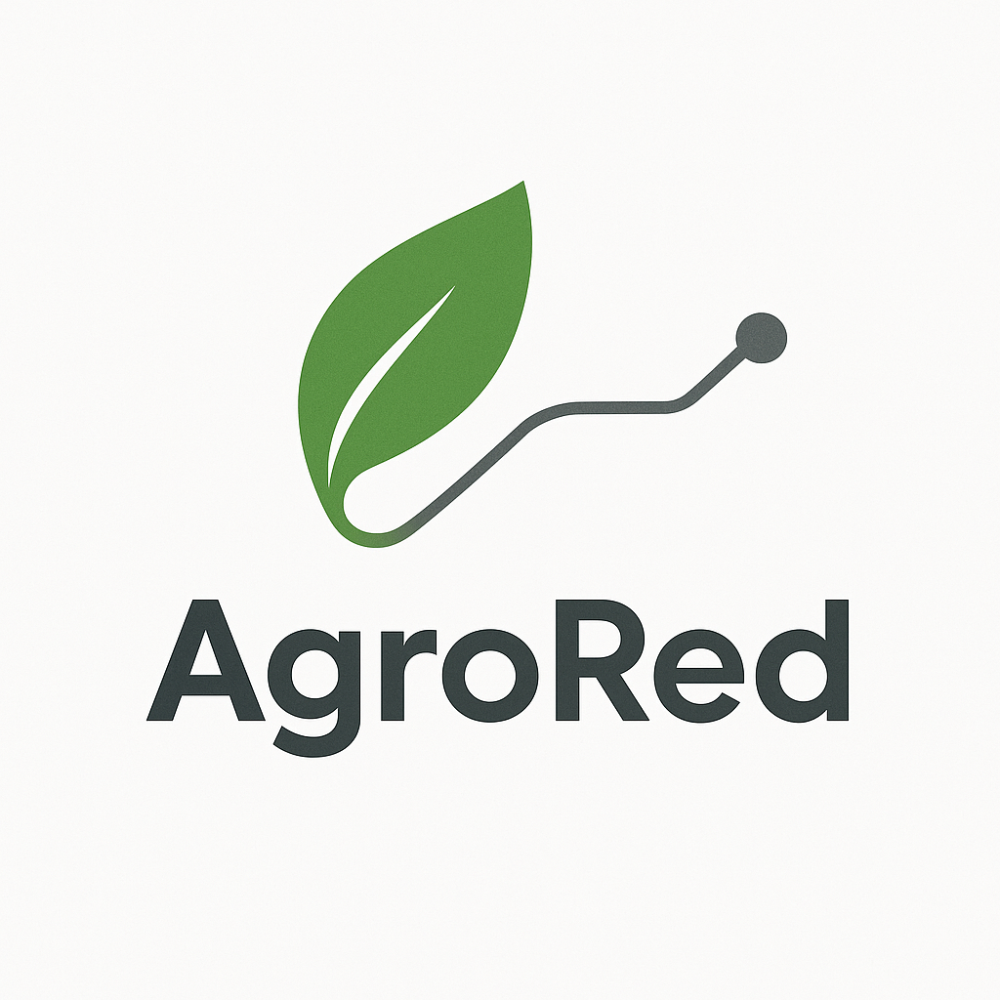
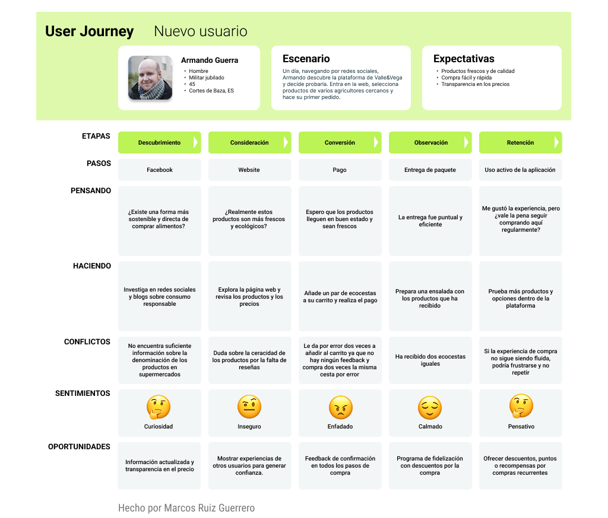

# DIU25
Prácticas Diseño Interfaces de Usuario (Tema: .... ) 

[Guiones de prácticas](GuionesPracticas/)

Grupo: DIU1.AlexMarcos  Curso: 2024/25 

Actualizado: 08/04/2025

Proyecto: 

AgroRed

Descripción: 

El proyecto va a desarrollar una página web donde agricultores locales pueden vender sus productos directamente a los clientes finales, evitando intermediarios y limitando transportes innecesario, ademas, en un futuro esto se hara en vehiculos de bajas emisiones, reduciendo aun la huella de carbono generada en el proceso de venta. Aquí cada agricultor podrá poner en venta su producto a un precio que le permita tener un margen mayor de beneficio ocasionado por la reduccion de intermediarios. Esta aplicación tiene el objetivo de no solo beneficiar al vendedor y al cliente, sino también reducir el perjuicio en el ecosistema. Si propiciamos el cultivo de productos autóctonos desarrollados en su medio adaptativo, conseguiremos un mejor uso del agua, mucho más eficiente. Esto también nos lleva a la conclusión, de que el uso de fertilizantes y pesticidas será significativamente inferior ya que, la planta tiene sus propios medios naturales para protegerse.

Logotipo: 

Miembros:
 * :bust_in_silhouette:  [Alejandro Molina Ruiz](https://github.com/AlexMr08)     :octocat:     
 * :bust_in_silhouette:  [Marcos Ruiz Guerrero](https://github.com/marcosarmilla)     :octocat:
----- 

# Proceso de Diseño 

 

## Paso 1. UX User & Desk Research & Analisis 

Hemos estado investigando sobre mercados sostenibles, buscando una buena forma de lanzarnos a este mercado en busca de aumentar la competencia y añadir una nueva alternativa para la gente que busca comida mas saludable y economica, ademas de ayudar a los productores locales. Para ello debemos determinar la viabilidad del mercado, identificar las necesidades y las preferencias tanto de agricultores como de consumidores y evaluar el impacto ambiental y economico de esta actividad. Ademas debemos preguntarnos ciertas cuestiones como si estamos, como sociedad concienciados con el medioambiente o si este proyecto tendra un impacto positivo en el ecosistema.
Por ultimo debemos realizar un estudio basado en nuesta experiencia y en la observacion.

### 1.a User Reseach Plan
 
-----

Desarrollaremos una pagina y una aplicacion movil que ponga en contacto a agricultores y a potenciales clientes, de forma que los agricultores puedan vender sus productos reduciendo el numero de intermediarios presentes en el proceso de venta, haciendo a su vez que el precio del producto se reduzca. Ademas buscamos reducir el perjuicio en el ecosistema propiciando el cultivo de productos autoctonos y a su vez reduciendo el desperdicio de agua y el uso de pesticidas.

Para la seleccion de participantes, buscaremos la ayuda de agricultores concienciados con la agricultura sostenible, personas que buscan tener una vida mas saludable o hosteleros que busquen mejorar la calidad de sus productos.

### 1.b Competitive Analysis
 
-----

Hemos realizado un estudio de la competencia en base a una serie de propuestas que se encuentran disponibles en el mercado.
Empezamos con ecomercado de granada, esta propuesta es la que menos nos ha gustado ya que solo actualizan sus redes sociales, aunque en ellas informa sobre cuando y donde se realizara el proximo mercado en Granada.
Luego tenemos Valle&Vega, esta nos ha parecido de las mejores opciones, ya que permite la recogida en diversos locales de Granada, pero tiene un problema que comparten la mayoria, el envio gratuito parte de los 60 euros.
Seguimos con ecocentro, que esta afincada en Madrid, es parecido a Valle&Vega pero el reparto de productos frescos se limita a Madrid. Su envio gratuito parte de 49€.
Otra alternativa es Naturitas, esta se aleja del modelo de mercado sostenible y se centra mas en la venta de productos ecologicos, pero prescindiendo de frutas y verduras.
Tambien esta Biobay, que tampoco vende productos frescos pero si que vende productos veganos. Su envio gratuito empieza en 79€.
Finalizamos con Biosano, que se parece bastante a las 2 anteriores pero tiene menos productos alimenticios. Su envio gratuito arranca en 49€.

Por todo lo anteriormente citado, haremos el analisis de competencia en base a Ecomercado y Valle&Vega por su cercania a nuestra alternativa y a Biosano porque es la que mas se aleja de nuestra alternativa.

Tras realizar el analisis vemos como la competencia mas fuerte sera Valle&Vega.

### 1.c Personas
 
-----

- Armando Guerra

Es un soldado jubilado tras perder las piernas en la guerra, es una persona voluntariosa y agresiva, aunque tiene un fondo compasivo. Una de sus preocupaciones es la gran deforestacion que se esta produciendo en diversas zonas. Una de sus metas es concienciar a la gente en temas polemicos como el cambio climatico o los derechos humanos.

- Gara Suarez

Es una chica nacida en Canarias, que se mudo a Granada de pequeña, es diseñadora grafica, aunque inicialmente estudio turismo. Una de sus metas es abrir su propio estudio de diseño y una de sus preocupaciones es el gran daño que esta realizando el cambio climatico en la biodiversidad.

### 1.d User Journey Map
 
----

- Journey Map de Armando

Armando es una persona temperamental, al usar Valle&Vega compra dos veces el mismo producto, en parte por despiste, pero tambien por la ausencia de un feedback positivo en la web. Esto le lleva a enfadarse, pese a esto, tras recibir el pedido y ver que llega en buenas condiciones, se pregunta si merece la pena seguir comprando en el sitio. Esto no tiene por que ser habitual, ya que pese al poco feedback de la web, si revisamos el carrito evitaremos estos problemas.

- Journey Map de Gara

Gara conoce la web Valle&Vega por un amigo, que le cuenta lo bien que esta. Tras entrar en la web, esta no le sorprende a nivel visual, aun asi decide arriesgarse, al llegar terminar de elegir que comprar y proceder a rellenar sus datos ve como se piden muchos datos que no deberian ser necesarios y esto le molesta, aunque finalmente realiza la compra y finalmente sigue comprando en esta, aunque no termina de convencerle. Esto es habitual sobre todo en gente a la que le moleste introducir muchos datos en internet. 

### 1.e Usability Review
 
----

- Enlace: [Usability Review](P1/usabilityReview.pdf)
- [Valle&Vega](https://valleyvega.org/) - Nota: 80
- Sus puntos mas debiles se encuentran sobre todo en la busqueda ya que no permite filtrar mas haya del nombre y no se puede ordenar por popularidad. Otro punto deil es el mal feedback visual que tiene la pagina. Sus principales puntos fuertes son que su navegacion por el sitio es muy buena y el rendimiento de la web es bastante bueno, aunque a veces tarda un poco en cargar.

 

## Paso 2. UX Design  

### 2.a Reframing / IDEACION: Feedback Capture Grid / EMpathy map 
 
----

Tras lo visto anteriormente realizamos una malla receptora de informacion en base a lo visto en la competencia, tenemos los puntos fuertes, como que hay algunas empresas que realizan envios refrigerados, o que los productos estan bien organizados, pero tambien puntos deviles como que la mayoria tiene un coste muy alto para realizar el envio de forma gratuita o que hay opciones en las dependiendo del dia habra ciertos productos o se habran acabado.
Nuestras personas ademas se realizaron ciertas preguntas tales como si se podrian realizar compras recurrentes o si se contamina lo mismo o mas haciendo el pedido online.
Por ultimo tenemos una serie de ideas que se nos han ocurrido a nosotros, como el realizar envios a diario o realizar los envios con vehiculos hibridos o electricos para reducir aun mas la contaminacion.

Ademas hemos realizado un mapa de empatia en el que nuestras personas cuentan lo que ven, lo que siente, dicen, piensan y escuchan, ademas de sus dolores y sus beneficios. Asi vemos como Armando se pregunta si deberia tener su propio huerto o como ve que han cerrado la fruteria de su barrio y que uno de sus dolores es si es el unico que se preocupa por el medio ambiente. Luego tenemos a Gara que escuha que las verduras llevan demasiados quimicos o como se queja del poco tiempo que tiene para salir a pasear y como uno de sus dolores es ver comercios locales cerrar.

    

### 2.b ScopeCanvas

----

Como podemos ver nuestro proposito es cuidar a nuestros agricultores y al medio ambiente, ademas de a nuestros potenciales clientes gracias a reducir el gasto en alimentos frescos y a la vez aumentando el margen de ganancias de nuestros agricultores, ademas de ser mas transparentes con el origen del producto. Para hacer esto nos ponemos como objetivos a corto plazo el disponer de una plataforma con varios metodos de pago, ademas de añadir opciones de recogida en la ubicacion del agricultor o de fomentar la compra de productos mas sanos. A mas largo plazo, nos gustaria disponer de acuerdos con empresas de transporte verdes o crear mapas con las localizaciones de los distintos agricultores. De forma que los usuarios de nuestro producto, puedan buscar y comprar productos agricolas y que nuestros agricultores puedan vender su producto, entre otras acciones.

### 2.b User Flow (task) analysis 
 
-----

Hemos realizado una de las actividades mas importantes de la plataforma, la compra de productos, en esta, suponemos que el cliente ya tiene la sesion iniciada y productos en la cesta, por lo que procede unicamente a acceder al carrito, rellenar los datos de envio y los datos de pago, para acabar viendo que su pedido se ha realizado correctamente.

### 2.c IA: Sitemap + Labelling 
 
----

- Sitemap:

 

- Labelling:

 [Labeling](P2/Resources/Labeling.pdf)

### 2.d Wireframes
 
-----

- Hemos realizado los wireframes a mano

 
 
 
 
 

## Paso 3. Mi UX-Case Study (diseño)

### 3.a Moodboard

-----

Para el moodboard hemos usado figma que nos ha permitido hacer una tablero bastante atractivo visualmente con todas los apartados necesarios.

Para el logo, hemos usado una IA para el diseño base, aunque posteriormente hemos usado inkscape para hacer las distintas variaciones y pasar el logo a un formato vectorial.

Para la seleccion de colores empezamos con una gama cromatica basada en un tono de verde bastante claro, que recuerda a la naturaleza y un gris oscuro para tener suficiente contraste, posteriormente usamos [coolors](https://coolors.co/) para buscar colores adicionales.

### 3.b Landing Page
 
----

La landing page estara compuesta por una pagina que en base a que boton pulses mostrara una informacion u otra, ademas podremos realizar 2 acciones, registrarnos o acceder a la tienda.
Como podemos ver, ademas se desvincula del patron en F para darle mas personalidad al sitio.

### 3.c Guidelines
 
----

  - Onboarding: sera la pagina que encuentra el usuario al abrir la aplicacion por primera vez. Esta tendra nuestro logo, junto a la frase motivacional del landing page y un boton para continuar que nos llevara al inicio de sesion.
Menu de navegacion: Usaremos el ya clasico menu inferior con 4 botones de material 3, que haran referencia a la pagina principal, el buscador, el carrito y por ultimo nuestro perfil.

  - Hero image + carousel: Se usara para mostrar ofertas y noticias en la pagina principal y para mostrar imagenes del producto seleccionado.
  
  - Search: Se usara para que el usuario pueda buscar los poductos, estar situado en la app bar.

  - Wizards: Hemos usado un wizard para el proceso de compra. Este esta compuesto de 4 puntos, el primero para introducir datos personales y direccion, un segundo para elegir metodo de pago e introducirlo, el tercero para revisar el pedido y finalmente el cuarto para ver un resumen del pedido tras realizar la compra.

  - Article list: Usaremos listas para mostrar los productos, asi como los distintos pedidos realizados por el usuario.

  - Item details + actions: Los usaremos para mostrar detalles de cada producto, y tendremos una accion para añadirlo al carrito.

  - Form input: Se usaran formularios para iniciar sesion y registrarse, ademas tendremos un formulario de contacto y los necesarios para el proceso de pago. Para todos ellos usaremos los componentes disponibles en material 3.

  - shopping cart: Mostrara una lista con los productos que hay en el carrito, ademas encontraremos un boton para finalizar la compra.

  - About: Mostrara informacion sobre nuestra empresa.

### 3.d Mockup
 
----

Dejamos por aqui nuestro [mockup](P3/mockup.png)

### 3.e ¿My UX-Case Study?
 
-----

Para ver el proyecto en: 

- [Proyecto en general](https://www.figma.com/design/fEPwFvG5xXuyaPYDpQoL0X/DIU_Toolkit_Framework--beta-2025-?node-id=18-14661&p=f&t=Gpi5thvdt7WQ5GbI-0)

- [Mockup](https://www.figma.com/proto/fEPwFvG5xXuyaPYDpQoL0X/DIU_Toolkit_Framework--beta-2025-?node-id=40000423-5027&p=f&t=Gpi5thvdt7WQ5GbI-0&scaling=min-zoom&content-scaling=fixed&page-id=18%3A14661&starting-point-node-id=40000423%3A5027)

 

## Paso 4. Pruebas de Evaluación 

### 4.a Reclutamiento de usuarios 

-----

>>> Breve descripción del caso asignado (llamado Caso-B) con enlace al repositorio Github
>>> Tabla y asignación de personas ficticias (o reales) a las pruebas. Exprese las ideas de posibles situaciones conflictivas de esa persona en las propuestas evaluadas. Mínimo 4 usuarios: asigne 2 al Caso A y 2 al caso B.

  | Usuarios | Sexo/Edad     | Ocupación   |  Exp.TIC    | Personalidad | Plataforma | Caso
  | ------------- | -------- | ----------- | ----------- | -----------  | ---------- | ----
  | Alvaro        | H / 20   | Estudiante  | Media       | Introvertido | Web.       | A 
  | Maria         | M / 52   | Delineante  | Media       | Tranquila    | Web        | A 
  | Pablo         | H / 24   | Estudiante  | Baja        | Curioso      | Web        | A 
  | Jose Maria    | H / 20   | Estudiante  | Alta        | Tranquilo    | Web        | A
  | Nosotros      | H / 24   | Estudiantes | Alta        | Curioso      | Web        | B 
  | Pepe          | H / 60   | Mecanico    | Media       | Curioso      | Web        | B 
  | Natalia       | M / 25   | T.Social    | Alta        | Emocional    | Móvil      | B 
  | Ana           | M / 27   | Farmacéutica| Media       | Racional     | Móvil      | B

### 4.b Diseño de las pruebas 
 
-----

>>> Planifique qué pruebas se van a desarrollar. ¿En qué consisten? ¿Se hará uso del checklist de la P1?

### 4.c Cuestionario SUS
 
----

>>> Como uno de los test para la prueba A/B testing, usaremos el **Cuestionario SUS** que permite valorar la satisfacción de cada usuario con el diseño utilizado (casos A o B). Para calcular la valoración numérica y la etiqueta linguistica resultante usamos la [hoja de cálculo](https://github.com/mgea/DIU19/blob/master/Cuestionario%20SUS%20DIU.xlsx). Previamente conozca en qué consiste la escala SUS y cómo se interpretan sus resultados
http://usabilitygeek.com/how-to-use-the-system-usability-scale-sus-to-evaluate-the-usability-of-your-website/)
Para más información, consultar aquí sobre la [metodología SUS](https://cui.unige.ch/isi/icle-wiki/_media/ipm:test-suschapt.pdf)
>>> Adjuntar en la carpeta P4/ el excel resultante y describa aquí la valoración personal de los resultados 

### 4.d A/B Testing
 
-----

>>> Los resultados de un A/B testing con 3 pruebas y 2 casos o alternativas daría como resultado una tabla de 3 filas y 2 columnas, además de un resultado agregado global. Especifique con claridad el resultado: qué caso es más usable, A o B?

### 4.e Aplicación del método Eye Tracking 

----

Para la realización de la prueba se ha utilizado con realeye.io, una solución para realizar estudios de seguimiento ocular a distancia y analizar los datos desde su navegador web. Se ha realizado la prueba sobre el caso B a los usuarios que les correspondia y estos han sido los resultados:

### 4.f Usability Report de B
 
-----

>>> Añadir report de usabilidad para práctica B (la de los compañeros) aportando resultados y valoración de cada debilidad de usabilidad. 
>>> Enlazar aqui con el archivo subido a P4/ que indica qué equipo evalua a qué otro equipo.

>>> Complementad el Case Study en su Paso 4 con una Valoración personal del equipo sobre esta tarea

 

## Paso 5. Exportación y Documentación 

### 5.a Exportación a HTML/React
 
----

>>> Breve descripción de esta tarea. Las evidencias de este paso quedan subidas a P5/

### 5.b Documentación con Storybook

----

>>> Breve descripción de esta tarea. Las evidencias de este paso quedan subidas a P5/

 

## Conclusiones finales & Valoración de las prácticas

>>> Opinión FINAL del proceso de desarrollo de diseño siguiendo metodología UX y valoración (positiva /negativa) de los resultados obtenidos. ¿Qué se puede mejorar? Recuerda que este tipo de texto se debe eliminar del template que se os proporciona 

